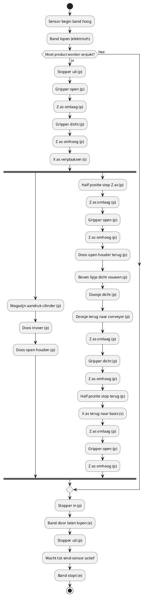

```plantuml
@startuml
start

:Sensor begin band hoog;
:Band lopen (elektrisch);
if (Moet product worden verpakt?) then (Nee)

else (Ja)
    :Stopper uit (p);
    :Gripper open (p);
    :Z as omlaag (p);
    :Gripper dicht (p);
    :Z as omhoog (p);
    :X as verplaatsen (s);

    fork
        :Magazijn aandruk cilinder (p);
        :Doos invoer (p);
        :Doos open houden (p);
    fork again
        :Half positie stop Z as (p);
        :Z as omlaag (p);
        :Gripper open (p);
        :Z as omhoog (p);
        :Doos open houder terug (p);
        :Boven lipje dicht vouwen (p);
        :Doosje dicht (p);
        :Doosje terug naar conveyor (p);
        :Z as omlaag (p);
        :Gripper dicht (p);
        :Z as omhoog (p);
        :Half positie stop terug (p);
        :X as terug naar basis (s);
        :Z as omlaag (p);
        :Gripper open (p);
        :Z as omhoog (p);
    endfork
endif

:Stopper in (p);
:Band door laten lopen (e);
:Stopper uit (p);
:Wacht tot eind-sensor actief;
:Band stopt (e);

stop
@enduml
```